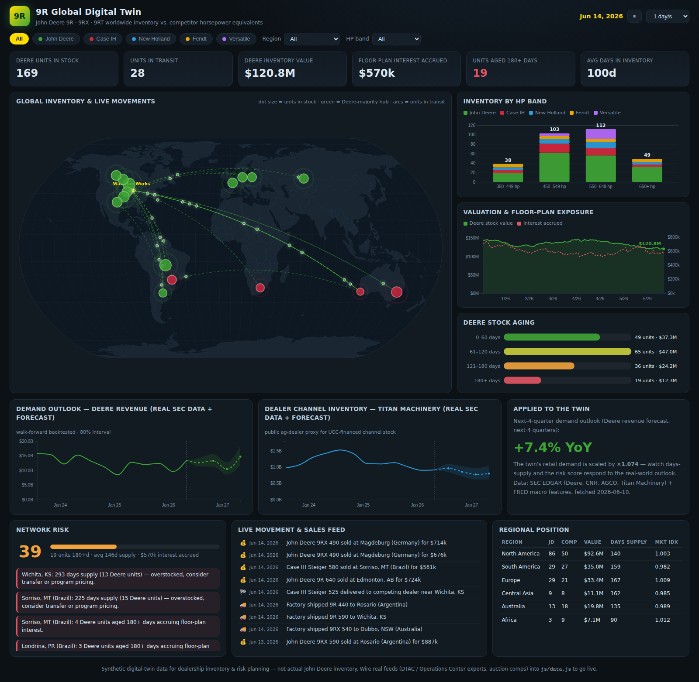

# 9R Global Digital Twin

An animated, living dashboard that models the worldwide inventory of **John Deere 9R-series tractors** (9R wheeled, 9RX four-track, 9RT two-track) alongside their **competitor horsepower equivalents** — Case IH Steiger/Quadtrac, New Holland T9, Fendt 1000/1100 Vario MT, and Versatile 4WD — so a Deere dealership can watch inventory levels, movement, and valuation evolve and manage floor-plan risk.



## What it does

- **Animated world map** — pulsing dots at 16 dealer hubs across 6 regions, sized by units in stock and colored by Deere vs. competitor majority. Animated arcs show every unit in transit: factory shipments out of Waterloo Works and dealer-to-dealer rebalancing transfers, each with a dot moving along the arc in sync with the simulation clock.
- **Inventory levels** — KPI cards (units in stock / in transit, inventory value, floor-plan interest accrued, 180+ day units, average days in inventory) plus a stacked **HP-band chart** comparing Deere against each competitor brand in the 350–449, 450–549, 550–649 and 650+ hp classes.
- **Movement** — a live feed of factory shipments, arrivals, transfers, competitor deliveries and retail sales.
- **Valuation** — every unit carries invoice, depreciation by days-in-inventory, and a drifting global + regional market index; the trend chart tracks total Deere stock value against accrued floor-plan interest over the trailing year.
- **Risk management** — a 0–100 network risk score blending aged-inventory share, days-of-supply, and interest-exposure ratio; an alert list (overstocked hubs, thin allocation, aged units, soft regional markets); and a regional position table with days-supply and market-index flags.
- **Simulation controls** — play/pause, 0.5–5 simulated days per second, and filters by brand, region, and HP band.

## Run it

No build step, no dependencies to install:

```bash
python3 -m http.server 8080
# open http://localhost:8080
```

or just open `index.html` in a browser (D3 and the world map load from a CDN, so you need to be online).

## How it works

| File | Role |
|---|---|
| `js/data.js` | The twin itself: hub network, model catalog with representative MSRPs, deterministic daily simulation (production, shipments, transfers, sales, depreciation, floor-plan interest, market drift), and risk/alert derivation. Runs in the browser and under Node. |
| `js/map.js` | D3 world map: pulsing hub inventory dots, animated transit arcs, hover tooltips with per-hub stock, value, days-supply and aging. |
| `js/charts.js` | HP-band stacked bars, valuation/exposure trend, aging buckets. |
| `js/main.js` | Simulation clock (1 tick = 1 simulated day), filters, KPIs, risk panel, feed, regional table. |
| `test/sim.test.js` | Invariant tests — run `node test/sim.test.js`. |

The world is **synthetic but self-regulating**: factory output and competitor deliveries adapt to network stock levels, sales follow regional demand with hemispheric seasonality (pre-planting peaks), and dealers push aged stock first. A fixed PRNG seed makes every load reproducible; change the seed in `js/main.js` (`Twin.createSim(9)`) for a different world.

### Key modeling assumptions (tune in `js/data.js`)

- Floor plan: 7.9% APR after a 120-day interest-free period.
- Depreciation: ~0.07%/day of invoice, floored at 55%, scaled by market indices.
- Transit: ~700 km/day overland, +10 days for inter-region (ocean) legs.
- Days supply: trailing 90-day Deere sales rate per hub, capped at 400.

## Going live

This ships with simulated data on purpose — swap the generator for real feeds without touching the UI:

1. Replace `createSim`/`tick` in `js/data.js` with fetches of your DMS / John Deere Operations Center inventory exports.
2. Feed real valuations from auction comps or guide books into `computeValue`.
3. Point movement events at your transport-management or allocation data.

## Forecasting on real internet data

The twin is designed for a dealership whose internal volume is too low to model alone — so the forecasting layer runs entirely on public internet data, no API keys required:

| Source | Series | Used as |
|---|---|---|
| SEC EDGAR XBRL | Deere quarterly revenue (2008→) | Deere demand proxy (forecast target) |
| SEC EDGAR XBRL | CNH Industrial, AGCO quarterly revenue | Competitor demand proxies |
| SEC EDGAR XBRL | **Titan Machinery** quarterly revenue & inventory (2011→) | Public ag-dealer group — the dealer-channel / UCC-style inventory proxy |
| FRED | Prime rate, ag-machinery PPI, corn/soy/wheat prices, unemployment, all-commodities PPI | Engineered macro features |

> **On UCC data:** state UCC filing databases (the direct record of floor-planned equipment) are not freely accessible programmatically — they require paid accounts (e.g., Texas SOSDirect) or bulk-data purchases. Titan Machinery's SEC-filed inventory is the closest free public substitute for dealer-channel inventory, and it backtests well.

**Engineered features** (`js/forecast.js`): YoY growth momentum, corn/soy/wheat price YoY (3-month trailing averages), 12-month prime-rate change (financing cost), ag-machinery PPI YoY (equipment inflation), unemployment change, broad PPI YoY — all computed strictly as-of the quarter before the one being predicted.

**Model:** ridge regression on YoY log growth (the YoY transform removes ag seasonality), lambda chosen by time-ordered CV, ensembled 50/50 with growth momentum. **Backtesting is strict walk-forward** — every prediction uses only data published before the quarter it predicts.

```bash
node scripts/fetch-external.js   # pull + cache real FRED / EDGAR data
node scripts/backtest.js         # walk-forward backtests + 4-quarter forecast
# open docs/forecast.html for backtest charts; the dashboard picks up the
# forecast automatically and scales the twin's demand by the outlook
```

**Feature lab** (`scripts/feature-lab.js`) systematically tested unconventional candidates — drought (US Drought Monitor weekly D2+ area), farm-margin composites (corn ÷ fertilizer/diesel/machinery PPIs), yield curve, consumer sentiment, machinery industrial production, housing starts, and dealer-channel cross-series. Two discoveries were promoted to production as *extended features* (with automatic fallback to core features where history is short):

- **`channel_sts`** — Titan Machinery stock-to-sales YoY (45-day filing lag). Lead correlation with Deere growth strengthens with horizon: −0.49 (1q), −0.59 (2q), **−0.65 (3q)**. Channel stuffing precedes manufacturer revenue declines by 2–4 quarters.
- **`umcsent_yoy`** — consumer sentiment YoY, an *inverse* correlate (−0.42 at 2q): ag booms ride high food/fuel prices, which depress consumer sentiment.
- **`diesel_yoy`** — farm input cost, supporting feature in the severity ensemble.

Backtest results (out-of-sample, vs. naive baselines, with extended features):

| Series | Test quarters | Ensemble MAPE | Seasonal-naive MAPE | Direction accuracy |
|---|---|---|---|---|
| Deere revenue | 36 | **8.0%** | 14.9% | 83.3% |
| CNH revenue | 36 | **10.1%** | 16.4% | 80.6% |
| AGCO revenue | 16 | **7.3%** | 16.8% | 87.5% |
| Titan (dealer) revenue | 44 | **9.0%** | 13.6% | 79.5% |
| Titan (dealer) inventory | 43 | **7.0%** | 25.2% | 90.7% |

At the **eve of the 2024 downturn** (zero-lookahead stress test standing at Oct 2023), the extended features turned the model's call from *flat* to *down* on all five series and cut 4-quarter path error by ~25–35%; at the **2020 boom onset** it predicted Deere's next-4-quarter change at +18.1% vs +16.4% actual. Severity capture on big-move quarters (|YoY| ≥ 12%) improved from 0.58 to ~0.70. Known remaining weakness: sharp V-recoveries (mid-2025) are still missed.

The dashboard's forecast panel charts the Deere revenue and dealer-inventory outlooks with 80% intervals and applies the average next-4-quarter YoY growth to the twin's retail demand (`Twin.setDemandScale`), so days-supply and the risk score respond to the real-world outlook.

## Historical playback

```bash
node scripts/replay.js   # replays ~2.5 years, prints a quarterly digest
# then open docs/replay.html (served over http) for the playback charts
```

Writes `docs/replay-data.json` and reports stock/value/exposure/risk trajectories, sales seasonality, Deere vs competitor share, and realized margin by inventory age at sale.

## Tests

```bash
node test/sim.test.js        # twin invariants over ~2.5 simulated years
node test/forecast.test.js   # solver, no-lookahead guarantee, synthetic + real-data accuracy
```

`sim.test.js` asserts fleet self-regulation, valuation sanity, transit bookkeeping, filter correctness, and bounded risk scores. `forecast.test.js` proves the backtester cannot look ahead (mutating future data must not change past predictions) and that the model beats seasonal-naive on both synthetic and cached real data.

---

*Synthetic data for planning and demo purposes — not actual John Deere inventory or pricing.*
